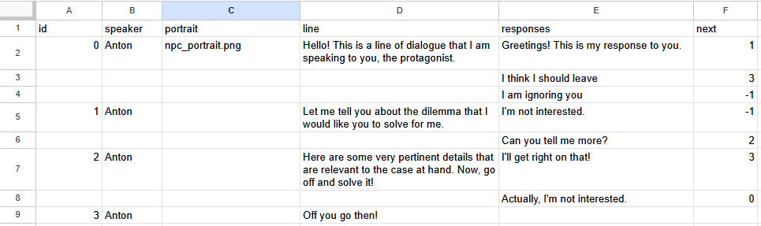

## Pangolengine: a 2D top-down game engine with dialogue trees

Pangolengine is a simple 2D top-down game engine inspired by the
[BirchEngine](https://github.com/carlbirch/BirchEngine) and built off Ravbug's
[sdl3-sample](https://github.com/Ravbug/sdl3-sample) template, which uses
[SDL3](https://wiki.libsdl.org/SDL3/FrontPage) and its libraries. The engine
has the following features:

- Character movement and animation on a top-down map with camera scrolling.
- Support for maps exported from the [Tiled Map
Editor](https://thorbjorn.itch.io/tiled), including tile maps, object sprites,
collisions and map transitions.
- Support for simple dialogue trees that can be written and imported from
[Google Sheets](https://docs.google.com/spreadsheets) and attached to NPCs.
- An entity-component system.
- A simple menu UI system.

The primary aim of the project was to learn C++, object-oriented programming and
the structure of simple game engines. It is primarily meant as an educational
project and is not a fully-fledged game engine.

See the example [main.cpp](examples/demo/main.cpp) as a starting point for the
main loop, and [DemoGame.cpp](examples/demo/DemoGame.cpp) for the implementation
logic.

### Building And Running

If you are a novice, the setup instructions are very similar to the [sdl3-sample
wiki](https://github.com/Ravbug/sdl3-sample/wiki/Setting-up-your-computer). Make
sure to substitute the sdl3-sample repository for this one if following those
instructions.

If you are familiar with using the command line and have Cmake and a C++
compiler installed, you can use the commands below:

```sh
# You need to clone with submodules, otherwise SDL will not download.
git clone https://github.com/mcmero/Pangolengine --depth=1 --recurse-submodules
cd Pangolengine
cmake -S . -B build
cmake --build build --parallel --target pangolengine_demo
```
You can also use an init script inside [`config/`](config/). Then open the IDE project inside `build/` 
(If you had CMake generate one) and run the executable under `build/Debug/`.

## Supported Platforms

The [sdl3-sample](https://github.com/Ravbug/sdl3-sample)
that this engine is based off has support for a [number of platforms](https://github.com/Ravbug/sdl3-sample?tab=readme-ov-file#supported-platforms).
For the simplicity of my development process however, I am currently only
supporting Windows, but in theory it should be possible to compile easily on
Linux, Mac OS and web via wasm*.

*See further instructions in [`config/`](config/)

## Updating SDL and its libraries

Just update submodules like so:
```sh
cd SDL
git pull
```
You don't need to use a submodule, you can also copy the source in directly.
This repository uses a submodule to keep its size to a minimum.

## Controls

- Movement: W-A-S-D
- Talk to NPC: E
- Dialogue choices: up/down/enter
- Dialogue scroll: W/S
- Menu open/close: ESC
- Menu navigation: arrow keys/enter

## Making compatible maps in Tiled

This engine supports maps made via the [Tiled Map
Editor](https://thorbjorn.itch.io/tiled) (I've only tested v1.11.0). The
following files contain example tilesets:

- [Objects.tsx](assets/tilesets/Objects.tsx) -- contains sprite objects.
- [TilemapOutdoor.tsx](assets/tilesets/TilemapOutdoor.tsx) -- contains a tile
map.

The tile map is designed to be used with tile layers which form the basic
structure of the map. The sprite objects are used to represent entities that can
be freely placed on the map.

Layers in your Tiled map need to be named and arranged in the following way to
be compatible with this engine, described below.

### Tile layer

Must be a tile layer called 'Tiles'. This layer contains the basic map
structure. The engine uses 16x16 tiles by default.

### Sprite layer

Must be an object layer called 'Sprite'. The sprite objects support collision
rectangles that can be attached to a given object via Tiled (currently, only
collision a single collision rectangle is supported per object). For more
information on how to do this, please see the [Tiled
docs](https://doc.mapeditor.org/en/stable/manual/objects/). In case of large
sprite structures (like the tower buildings included in the examples), it is
best to split up your object so that you can give each section its own collider.

### Player layer

Must be an object layer called 'Player'. This contains the player starting
location, represented by the player sprite's location on this layer (note that
the position will be slightly shifted in-game to align your character to the
grid). The player sprite has object needs to have specific custom properties:

- `animations` -- file location of the player
animations file.
- `sprite_offset_x` -- offset the sprite by this many pixels to align it to the
  grid. Typically for a 32x32 pixel sprite, set this to 8 (half a tile).
- `sprite_offset_y` -- offset for a sprite in the y axis, usually set this to 0.
- `spritesheet` -- spritesheet file location.

Any file locations are relative to the tileset where the object is contained.

A player spritesheet is a JSON file that looks like this:

```json
{
  "animations": [
    {
      "name": "walk_front",
      "index": 0,
      "frames": 4,
      "speed": 150
    },
    {
      "name": "walk_side",
      "index": 1,
      "frames": 4,
      "speed": 150
    },
    {
      "name": "walk_back",
      "index": 2,
      "frames": 4,
      "speed": 150
    }
  ]
}
```

This describes the animations for walking facing the camera, to the side and way
from the camera. The index values and frames correspond to the sprite sheet
defined above, where the index corresponds to the sprite row and the frames is
the number of animation frames. So, in this case we have a 3-row sprite sheet
with 4 frames of animation in each row.

### Collision layer

Must be an object layer called 'Collision'. On this layer, you can place
rectangles that serve as collision objects for the player. These collisions
will move relative to the tile map (they are unrelated to any entity however).

### Transition layer
Must be an object layer called 'Transition'. On this layer, you can add
rectangles to define transitions. To do this, add a custom property called `map`
with the name of the map file (which must be present under `assets/maps`). When
a player walks on to the transition layer, the map will change to the defined
map.

### Interaction layer

Must be an object layer called 'Interaction'. Place interaction rectangles over
NPC sprite objects to allow dialogue with them. Interactions must contain the
following custom properties:

- `linked_id` -- the Object ID of the sprite that the interaction corresponds
to.
- `scene_file` -- name of the dialogue JSON file (must be in the `assets/scenes`
directory). The format of dialogue files is described below.

## Dialogue system

Dialogue trees can be written using Google Sheets. Below is an example:



The columns are described below:

- `id` -- node ID for the line of dialogue and possible responses.
- `speaker` -- the name of the NPC speaking.
- `portrait` -- the portrait file for the character (must be under
`assets/textures`). You can change this per dialogue line or leave it blank to
retain the previous image.
- `line` -- the line of dialogue.
- `responses` -- possible dialogue responses, one per row. Leave blank if there
  is no response for the given line.
- `next` -- the ID of the next dialogue node if the response is selected. `-1`
exits the dialogue.

The dialogue files read by the engine are in JSON format (see [the example
dialogue file](assets/scenes/S001_Test.json)) but can be generated by running a
Python script that fetches a Google Drive folder and converts the spreadsheets
into JSON files ready for use by the engine.

[The script](scripts/get_dialogue_files.py) uses the Google API Python Client,
so see
[here](https://googleapis.github.io/google-api-python-client/docs/oauth.html)
for more information on the associated authentication and app permissions you
will have to set. You will also have to [set up a `credentials.json`
file](https://developers.google.com/workspace/guides/create-credentials) and put
it in your `$HOME` folder.

The next step is to put all your dialogue files into a folder
on Google Drive, and then extract the ID by looking at the folder URL:
`https://drive.google.com/drive/folders/YOUR_GOOGLE_DRIVE_FOLDER_ID`.

The script can then be run via:

```bash
python .\scripts\get_dialogue_files.py YOUR_GOOGLE_DRIVE_FOLDER_ID
```

The first time you run it you will need to authenticate. Once the session times
out, you may want to delete the pickle file under `$HOME\token.pickle` to avoid
authentication errors.

## Reporting issues
Is something not working? Create an Issue or send a Pull Request on this repository!

## References and resources

- [sdl3-sample](https://github.com/Ravbug/sdl3-sample) -- template used to make
  this project.
- [SDL3](https://wiki.libsdl.org/SDL3/FrontPage) -- for more information and
documentation on SDL3.
- [Tiled Map Editor](https://thorbjorn.itch.io/tiled) -- used to make
  the maps in this game.
- [Aseprite](https://www.aseprite.org/) -- sprite and pixel-art editor I used to
  make the sprite assets.
- [Furnace](https://github.com/tildearrow/furnace) -- a chip-tune tracker that I
  used to make the sound assets.
- [Let's Make
Games](https://www.youtube.com/playlist?list=PLhfAbcv9cehhkG7ZQK0nfIGJC_C-wSLrx)
-- A great series of tutorials if you want to get started making a game engine
with SDL (note that this series uses SDL2).

